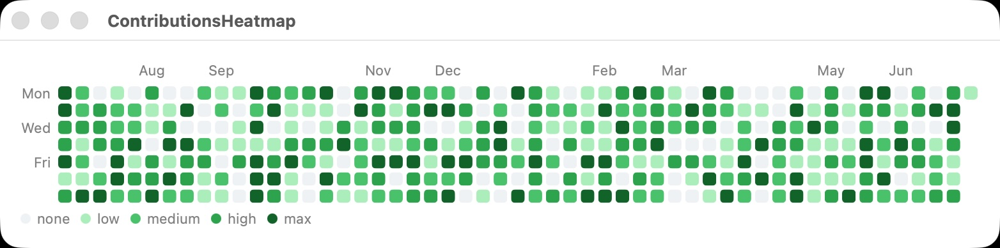
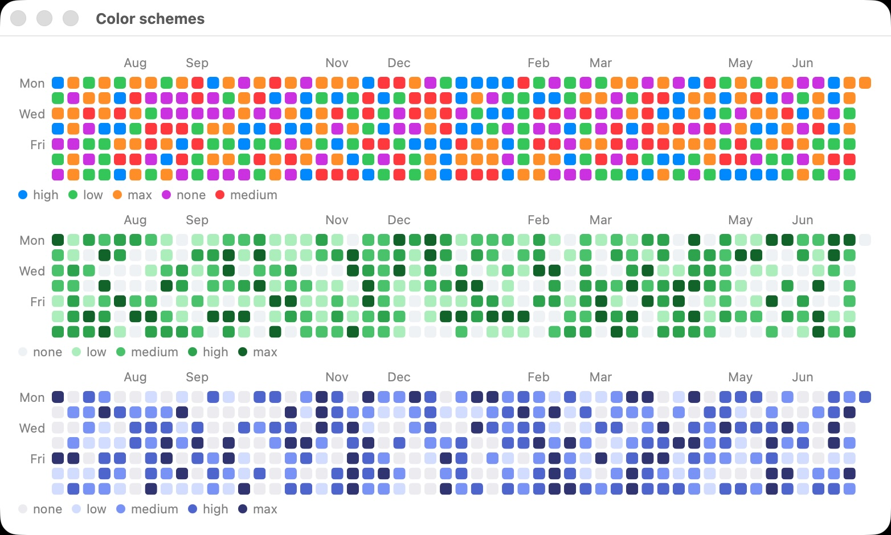

# ContributionsHeatmap

A heatmap in the style of GitHub's contributions heatmap on each user profile.



## Requirements

This package uses Swift Charts under the hood, and has the following requirements:

- macOS 14
- iOS 17
- tvOS 17
- watchOS 10
- visionOS 2

## Installation

Swift Package Manager:

```swift
dependencies: [
    .package(url: "https://github.com/sgade/swiftui-contributionsheatmap", from: "1.0.0")
],
targets: [
    .target(name: "YourTarget", dependencies: [
        .product(name: "ContributionsHeatmap", package: "swiftui-contributionsheatmap")
    ])
]
```

Or in Xcode: **File → Add Package Dependencies…** → paste the repo URL.

## Getting started

Adding a heatmap to your views:

```swift
ContributionsHeatmap(
    data: [...]
)
```

## Customizing the heatmap

You can use the standard `Charts` modifiers to customize the heatmap.
Examples of this include `chartXAxis(.hidden)`, `chartYAxis(.hidden)`, `.chartLegend(.hidden)`.

If you wish to customize the default Swift Charts colors, you can make it look like GitHub or GitLab:



```swift
ContributionsHeatmap(data: ...)
    .chartForegroundStyleScale(.gitHub)
```

## LICENSE

See `LICENSE`.
